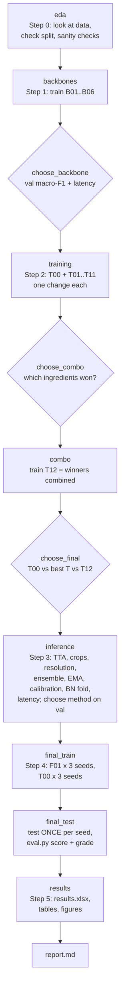
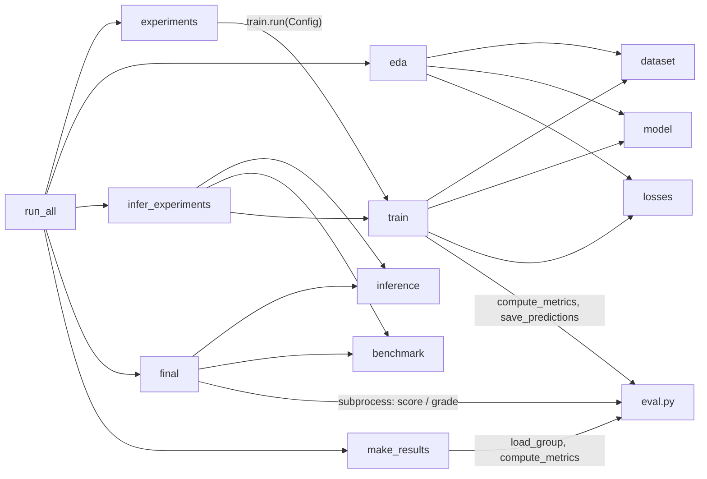

# How this project works: a guided tour from the first line to the last

This document explains the whole Lab Day 2 project for someone who has never seen it before. It covers what problem we solve, the order in which things happen, and what every file and function does: what goes in, what comes out, and which other functions it talks to. Think of the code as a graph. Files are neighbourhoods, functions are houses, and every arrow is a road that one function travels to get the data it needs from another.

---

## 1. The story in one paragraph

A farming robot in Queensland, Australia drives through fields and photographs the ground. For every 256×256 photo it must say which of **9 classes** it sees: one of 8 weed species (Chinee apple, Lantana, Parkinsonia, Parthenium, Prickly acacia, Rubber vine, Siam weed, Snake weed) or `Negatives` (plants we don't care about). This is the **DeepWeeds** dataset: 17,509 photos, and over half of them are `Negatives`. Because the classes are so imbalanced, plain accuracy is misleading. A model that always says "Negatives" already scores 52%, so our main score is **macro-F1**, the average F1 over the 9 classes.

The lab is a scientific experiment, not just "train a model". We must:

1. compare **≥5 backbones** (the feature-extracting part of the network) under one identical recipe;
2. measure what each **training-recipe ingredient** is worth (initialisation, augmentation, loss, sampling, learning rate, EMA), changing *one thing at a time*;
3. compare **≥4 inference tricks** (test-time augmentation, resolution, ensembles, calibration, BatchNorm folding) by accuracy *and* properly measured latency;
4. pick the best configuration using **only the validation set**, retrain it with 3 seeds, and touch the **test set exactly once per seed**;
5. hand in a spreadsheet, training curves, prediction files, and a report.

The golden rule that shapes all the code: **train → weights, val → every decision, test → only the final report.**

---

## 2. The map (folders)

```
K4-DAY02-.../                         repository root
├── eval.py                           official scorer (given, never modified)
├── README.md, GUIDE.md, RUBRIC.md    the assignment
├── starter/                          the original pseudo-code skeleton (left untouched)
├── tests/                            the course's own tests for eval.py and starter/
├── data/labels/                      fold CSVs: train/val/test_subset0.csv, labels.csv
├── images/                           17,509 .jpg files (not committed)
├── PROJECT_WORKFLOW.md               this document
└── submissions/2A202602781_NguyenCongThinh/   ← the submission; every command runs from here
    ├── code/                         all Python code (the skeleton, completed + orchestration)
    ├── runs/                         checkpoints, logits, histories, image cache (git-ignored)
    ├── curves/                       one training-curve PNG per experiment
    ├── predictions/                  test/val prediction CSVs in eval.py's format
    ├── figures/                      EDA plots, confusion matrix, trade-off plots
    ├── results/                      decisions.json, inference.csv, latency.csv, eval/ outputs, tables.md
    ├── results.xlsx                  the comparison spreadsheet (7 sheets)
    ├── report.md                     the written conclusions
    └── README.md                     how to reproduce
```

---

## 3. The big picture: the workflow as a graph

Everything is driven by **one command**, `python code/run_all.py all`, which walks through eleven *stages* in order. Each stage is safe to re-run: finished work is detected and skipped, and an interrupted training run resumes from its last epoch.



The diamonds are **decisions**. They never look at the test set. Each one applies a written rule to validation numbers and records the choice *and its reason* in `results/decisions.json`. If a human disagrees, they write their own choice into `results/decisions_override.json` and re-run the later stages.

Underneath the stages sits a small set of building blocks. This second graph shows who calls whom:



The most important design idea is that **there is only one training function**, `train.run(cfg)`. Every one of the ~25 training runs (B01…, T00…, F01…) is the same function called with a different `Config`. An experiment is just a different setting of the dials, never different code. That is what makes the comparisons fair.

---

## 4. Walking the path, step by step

### Step 0: Look before you leap (`eda.py`)

We first count images per class in each split and confirm the three splits don't overlap and together contain exactly 17,509 files that all exist on disk (`dataset.check_split`). We draw the class histogram and compare it with the paper's Table 1, look at 3 photos per class, and compute pixel statistics. Then we run the debugging checklist from the lecture:

- **Initial loss.** A fresh 9-class head should give a loss of ln 9 ≈ 2.197. The check found that timm's default head on MobileNetV3 starts near 4.7, so `model.build_model` now zero-initialises the new head. Every backbone then starts at exactly ln 9.
- **Overfit one tiny batch.** 16 images, 80 steps, loss must go to ≈ 0. If it can't, something is broken.
- **Look at augmented images.** We undo the normalisation and plot them, to be sure images and labels still match.

### Step 1: Which backbone? (`experiments.py` → `train.run`)

Six backbones (GPU profile: ResNet-50, ConvNeXt-T, DeiT-S, Swin-T, EfficientNet-B0, MobileNetV3-L) are each trained once, with the same recipe and the same seed. For each we log parameters, GMACs, val macro-F1/top-1 and time per epoch. `run_all.stage_choose_backbone` then measures the batch-1 latency of every trained model. It keeps the backbones within 0.01 macro-F1 of the best (with one seed, smaller gaps are noise) and picks the **fastest** of them.

### Step 2: What makes a good recipe? (`experiments.TRAINING`)

On the chosen backbone, `T00` is the baseline recipe (it is literally the same run as the chosen `B0x`, so it is copied instead of retrained). Each of `T01…T11` changes **exactly one** ingredient: scratch vs frozen init, TrivialAugment, CutMix, vertical flips, label smoothing, focal loss, class-weighted CE, balanced sampler, equal LR for head and backbone, EMA. `stage_choose_combo` keeps, per axis, the best change that improved val macro-F1 by at least 0.003, and combines them into `T12`. This tests whether gains *add up*. `stage_choose_final` then picks whichever of {T00, best single T, T12} has the highest val macro-F1 as the final recipe.

### Step 3: How should we predict? (`infer_experiments.py`)

Without retraining, we take the chosen model and compare, on val: one view (`I00`), horizontal-flip TTA (`I01`), 5- and 10-crop TTA (`I02`), averaging probabilities vs logits (`I03`), testing at higher or lower resolution (`I04`), a 3-model ensemble (`I05`), EMA vs raw weights (`I06`), temperature scaling with ECE measured by 2-fold cross-validation on val (`I07`), and BatchNorm folding / AMP (`I08`), plus an ONNX Runtime CPU timing as a bonus. Latency is measured *properly*: warm-up runs are discarded, the GPU is synchronised before and after each timing, there are 100 repetitions, and we report p50/p95/p99 at batch 1 and throughput at batch 32. The method with the best val macro-F1 is chosen for the final model, provided it beats one view by at least 0.002.

### Step 4: The final exam (`final.py`)

`F01` (final recipe) and `T00` (baseline) are trained with seeds 0, 1 and 2. Then, **once**, `final.py` predicts the test set. T00 uses one view. F01 uses the chosen inference method plus a temperature `T` fitted on that seed's *validation* predictions. Predictions are written with `eval.save_predictions` and scored by calling the untouched `eval.py score` and `eval.py grade` in a subprocess. A marker file (`results/eval/TEST_DONE.json`) makes the script refuse to touch the test set a second time.

### Step 5: Tell the story (`make_results.py`, `report.md`)

All summaries, CSVs and prediction files are collected into `results.xlsx` (Backbones, Training, Inference, Final, PerClass, Latency, Summary). Test metrics are recomputed from `predictions/` with `eval.py`'s own functions, so the spreadsheet can never disagree with the official scorer. Markdown versions of the tables go to `results/tables.md`, and the report is written from them.

---

## 5. Every file and every function

The notation is **Input → Output**, followed by *Connections*: who calls it and what it calls. "Config" always means the `train.Config` dataclass described in §5.4.

### 5.1 `eval.py`: the official referee (given, never modified)

It only needs numpy and pandas. The functions we use:

| Function | Input → Output | Role and connections |
|---|---|---|
| `save_predictions(path, filenames, y_true, probs)` | file path, N names, N labels, N×9 softmax probabilities → `Path` of a CSV with `Filename, y_true, y_pred, p0..p8` | The only way we write prediction files. Called by `train._predict_and_save` and `final.main`. |
| `read_pred(path)` | CSV path → `Pred` object (filenames, y_true, y_pred, probs, seed) | Validates the format. Used inside `load_group`. |
| `compute_metrics(y_true, y_pred, probs)` | arrays → dict `{n, top1, macro_f1, balanced_acc, ece, nll, precision[9], recall[9], f1[9], support[9], confusion[9×9]}` | The single definition of every metric. Called by `train.metrics_from_logits` (checkpoint selection), `infer_experiments`, `make_results`. |
| `load_group(pattern, ref_csv)` | glob of per-seed files → `Group` (per-seed metrics + `summary` = {metric: (mean, std ddof=1)}) | Used by `make_results` for mean ± std over seeds. |
| `mean_std`, `fmt`, `confusion_matrix`, `load_names` | helpers | Formatting and confusion matrices in `make_results` / `final`. |
| `cmd_score`, `cmd_grade` (CLI) | glob patterns → printed tables, JSON/CSV in `--out` | Run by `final.run_eval` via subprocess. `grade` self-scores rubric part I. |

### 5.2 `code/dataset.py`: from files on disk to tensors

| Function | Input → Output | What it does and who uses it |
|---|---|---|
| `eval_resize(img_size)` | int → int | The resize-before-centre-crop size, keeping the 256/224 ratio (224 → 256, 128 → 146). Used by `build_transforms`, `train._make_split_loader`, `infer_experiments.val_loader`. |
| `load_split(labels_dir, fold=0)` | folder, fold → `(train_df, val_df, test_df)` with columns `Filename, Label` | Reads the three CSVs verbatim, with no filtering or re-splitting (rule S1). Called by `train.run`, `_predict_and_save`, `eda`, `infer_experiments`. |
| `check_split(train_df, val_df, test_df, images_dir)` | 3 DataFrames + image folder → dict `{"n": {train,val,test,total}, "ratio": {...}, "per_class": {split: {class: count}}, "overlap": {"train&val": 0, ...}, "duplicates_within", "union": 17509, "missing_files": 0, "ratio_warning"}` | Mandatory checks. Raises `AssertionError` on overlap, wrong total or missing files. Called at the start of every `train.run` and by `eda.run_eda`. |
| `build_transforms(train, img_size, aug)` | bool, int, `"basic"/"flipv"/"color"/"trivial"/"randaug"` → torchvision v2 `Compose` | Train: RandomResizedCrop + horizontal flip (+ the chosen extra), to float, ImageNet normalise. Eval: resize + centre crop, nothing random. |
| `preload_images(images_dir, size, cache_dir)` | folder, int, folder → `(memmap uint8 [N_all,3,size,size], {filename: row})` | Decodes every JPEG once (thread pool), stores `runs/cache/images_<size>.npy`, then memory-maps it. JPEG decoding every epoch is too slow otherwise. Used by `DeepWeedsDataset`. |
| `seed_worker(worker_id)` | int → None | Seeds numpy/random inside each DataLoader worker, for reproducible augmentation. |
| `DeepWeedsDataset(df, images_dir, transform, preload_size, cache_dir)` | → Dataset whose `[i]` is `(image_tensor[3,H,W], label:int, filename:str)` | Keeps the CSV order (needed to match logits to filenames). Reads from the cache if `preload_size` is set, else opens the JPEG with PIL. |
| `make_loader(df, images_dir, transform, batch_size, train, sampler, num_workers, preload_size, cache_dir, seed)` | → `DataLoader` yielding `(x[B,3,H,W], y[B], filenames)` | Train: shuffled with a seeded generator, or `sampler="balanced"` (weights 1/class count, ablation T09), `drop_last`. Eval: fixed order. |

### 5.3 `code/model.py`: the network

| Function | Input → Output | What it does and who uses it |
|---|---|---|
| `build_model(name, pretrained, num_classes, drop_rate, init, img_size, drop_path_rate, head_init)` | timm name + options → `nn.Module` with `.weight_tag` (e.g. `resnet50.a1_in1k`) and `.frozen_backbone` | Creates the timm model with a new 9-class head, zero-initialised by default. `init="scratch"` disables pretrained weights; `"frozen"` calls `freeze_backbone`. Passes `img_size` only to ViT/DeiT/Swin. Used by `train.run`, `train.load_trained_model`, `eda`. |
| `freeze_backbone(model)` | model → None | Sets `requires_grad=False` everywhere except the head (`model.get_classifier()`). |
| `head_module_names(model)` | model → set of module names | Lets `train.set_train_mode` keep the frozen backbone (and its BatchNorm) in eval mode. |
| `param_groups(model, lr_backbone, lr_head, weight_decay)` | → list of optimizer groups `[{"name", "params", "lr", "weight_decay"}, ...]` | Backbone weights (decay), backbone norm/bias (no decay), head weights (10× LR, decay), head bias (10× LR, no decay). Used by `train.build_optimizer`. |
| `count_params(model)` | → float (millions) | For the Backbones sheet. |
| `count_gmacs(model, img_size)` | → float (GMAC per image) | One forward pass under PyTorch's `FlopCounterMode`; MAC = FLOP / 2. |

### 5.4 `code/losses.py`: how wrong is the model?

| Function | Input → Output | What it does |
|---|---|---|
| `build_criterion(kind, **kw)` | `"ce"/"ls"/"focal"/"ce_weighted"` + options → loss module `(logits[B,9], y[B]) → scalar` | Factory used by `train.run`. |
| `LabelSmoothingCE(smoothing).forward` | logits, y → scalar | Hand-written: (1−ε)·CE + ε·mean(−log p). ε = 0 equals CE (tested). |
| `FocalLoss(gamma, alpha).forward` | logits, y → scalar | −(1−p_t)^γ log p_t, which down-weights easy examples. γ = 0 equals CE to within 1e-6 (tested). |
| `class_weights(counts, beta)` | 9 train counts → tensor[9] (mean 1) | 1/n_c, or "effective number" weights when β > 0. Only train counts are ever used. |
| `mix_batch(x, y, alpha, mode)` | batch → `(x_mixed, (y_a, y_b, λ))` | Mixup blends whole images. CutMix pastes a box and recomputes λ from the box's real area after clipping (tested pixel-exactly). |
| `mixed_loss(criterion, logits, (y_a, y_b, λ))` | → scalar | λ·L(y_a) + (1−λ)·L(y_b). Used by `train.train_one_epoch`. |

### 5.5 `code/train.py`: the engine room

`Config` is a dataclass holding every dial of one run: identity (`exp_id`, `seed`), model (`backbone`, `init`, `drop_rate`), data (`img_size`, `aug`, `sampler`, `mix`), loss (`loss`, `label_smoothing`, `focal_gamma`, `class_weight_beta`), optimisation (`epochs`, `batch_size`, `lr_backbone`, `lr_head`, `weight_decay`, `warmup_epochs`, `ema_decay`, `amp`, `optimizer`), hardware (`device="auto"` uses CUDA when present, `channels_last`, `num_workers`) and paths. `save_test_predictions` defaults to **False**, so training can never accidentally score the test set.

| Function | Input → Output | What it does and connections |
|---|---|---|
| `run_dir(cfg)` / `pred_path(cfg, split)` / `curve_path(cfg)` | Config → Path | `runs/<exp>/seed<k>/`, `predictions/<exp>_seed<k>_<split>.csv`, `curves/<exp>_<desc>.png`. |
| `set_seed(seed)` | int → None | Seeds Python, numpy and torch (CPU and CUDA); deterministic cuDNN. |
| `build_optimizer(model, cfg)` | → AdamW (or SGD) over `model.param_groups` | |
| `build_scheduler(optimizer, cfg, steps_per_epoch)` | → `LambdaLR` | Per-step linear warm-up for 1 epoch, then cosine to 0. Keeps the 10× head/backbone ratio. |
| `EMA(model, decay)` with `.update(model)`, `.state_dict()` | → object with a private copy `.module` | Exponential moving average of weights *and* BN buffers, with timm-style decay warm-up. Evaluated instead of the raw model when enabled. |
| `set_train_mode(model)` | model → None | `model.train()`, but a frozen backbone (including BatchNorm) stays in eval mode. |
| `train_one_epoch(model, loader, criterion, optimizer, scheduler, scaler, cfg, device, ema)` | → `{"train_loss", "train_acc", "lr", "lr_steps": [...], "time_s", "n_steps"}` | For each batch: optional Mixup/CutMix → AMP autocast (CUDA) → loss → scaled backward → optional clipping → step → scheduler step → EMA update. |
| `evaluate(model, loader, criterion, device, channels_last)` | → `(filenames, y_true[N], logits[N,9], loss)` | `model.eval()` + `torch.inference_mode()`, in file order. |
| `softmax_np(logits)` / `metrics_from_logits(y, logits)` | → probabilities / `eval.compute_metrics` dict | Guarantees we select checkpoints with the official metric definition. |
| `plot_curves(history, path, title, lr_steps)` | list of per-epoch dicts → PNG | Three panels: train/val loss, val macro-F1/top-1 (best epoch marked), LR per step. |
| **`run(cfg)`** | Config → summary dict `{exp_id, seed, backbone, weight_tag, best_epoch, val_macro_f1, val_top1, val_ece, val_f1_per_class[9], params_m, gmacs, train_time_per_epoch_s, ..., config}` | The heart of the project. Seed → write `config.json` (with library versions and GPU name) → `load_split` + `check_split` → loaders → `build_model`, `build_criterion`, optimizer, scheduler, GradScaler, EMA → resume from `last.pt` if it exists → for each epoch: `train_one_epoch`, `evaluate` on val, log, save `best.pt` when val macro-F1 strictly improves (ties keep the earlier epoch) → reload best, save val logits and predictions → (only if `save_test_predictions`) test once → `history.csv`, curve, `summary.json`. If an identical config already finished, it returns the old summary instead of retraining. |
| `load_trained_model(cfg, device, which)` | → eval-mode model with `best.pt` weights (`"raw"` = non-EMA weights) | Used by `infer_experiments`, `final`, `run_all`. |
| `_predict_and_save(cfg, split, device)` | → `(filenames, y, logits)` | 1-view predictions written to the run folder. Asserts that test is only touched when `save_test_predictions=True`. |
| `_make_split_loader`, `_cfg_key`, `resolve_device`, `env_info`, `_find_repo_root` | helpers | Loader per split; config comparison that ignores paths/workers; `"auto"` → CUDA or CPU; environment record; locating `eval.py`. |
| `parse_overrides(pairs)` / `main()` | `["seed=1", "loss=focal", ...]` → typed dict / CLI | `python code/train.py --set exp_id=B01 backbone=resnet50 seed=0` runs a single experiment by hand. |

### 5.6 `code/inference.py`: ways to make a prediction

| Function | Input → Output | What it does |
|---|---|---|
| `predict_logits(model, loader, device, view)` | → `(filenames, y, logits[N,9])` | One view (optionally transformed, e.g. flipped). |
| `predict_logits_multiview(model, loader, device, views_fn, amp)` | → `(filenames, y, [logits_view1, ..., logits_viewK])` | Reads the data once and runs K views per batch. The workhorse of Steps 3 and 4. |
| `view_identity`, `view_hflip(x)` | batch → batch | Identity and horizontal flip. |
| `views_multicrop(x, crop, flip)` | batch (not centre-cropped) → list of 5 (or 10) crops | Four corners + centre (+ their mirrors). |
| `views_multiscale(x, sizes)` | batch → list of resized batches | CNNs only (transformers have fixed position embeddings). |
| `aggregate_views(list_of_logits, space)` | → probabilities[N,9] | `"prob"`: mean of softmaxes; `"logit"`: softmax of the mean logit (compared in I03). |
| `ensemble_probs(list_of_probs)` | → probabilities | Plain average across models (I05). |
| `fit_temperature(val_logits, val_labels)` | → float T | Grid search, then LBFGS on log T to minimise val NLL. Never fitted on test. |
| `apply_temperature(logits, T)` | → softmax(logits/T) | Accuracy unchanged; confidence becomes honest (lower ECE). |
| `fuse_conv_bn(model)` | → a fused copy with `.n_fused_bn` | Folds each BatchNorm into the preceding convolution (w′ = γw/σ, b′ = β + γ(b−μ)/σ). Keeps timm's fused activation (`BatchNormAct2d`). |
| `check_fusion(model, fused, img_size, device)` | → max \|Δlogit\| | Must be ≈ 1e-5 or smaller (tests show ≤ 5e-8). |

### 5.7 `code/benchmark.py`: honest stopwatches

| Function | Input → Output | What it does |
|---|---|---|
| `bench(fn, warmup, iters, sync)` | callable → `{"p50", "p95", "p99", "mean", "std", "min", "max", "n", "warmup"}` (ms) | Discards warm-up runs, then times each call between two `sync()` calls (`torch.cuda.synchronize` on GPU). |
| `latency_report(model, batch_size, img_size, dtype, device)` | → dict ready for the Latency sheet (`gpu`, `dtype`, `batch`, `p50/p95/p99`, `images_per_s`, `torch`) | Random fixed input, forward pass only (no JPEG decoding); FP32 / AMP / FP16. |
| `tta_latency(model, k_views, ...)` | → dict incl. `ratio_vs_single` | Times K sequential passes and compares with K × one pass. |
| `cpu_name()` | → str | CPU model from the Windows registry, for the record. |

### 5.8 Orchestration files

**`code/experiments.py`: the catalogue of experiments.**
`PROFILES` holds two hardware settings. `gpu` follows GUIDE 1.4 exactly (224 px, 12 epochs, batch 64, AMP, six standard backbones); `cpu` is a reduced fallback, and `smoke` is a seconds-long self-test. `BASE` is the T00 recipe. `TRAINING` lists T01–T11 as `(axis, description, overrides)`.

| Function | Input → Output | Role |
|---|---|---|
| `load_decisions()` / `save_decision(**kw)` | → dict / writes `results/decisions.json` | The memory shared between stages (chosen backbone, combo, final recipe, inference method, reasons). |
| `backbone_cfg`, `training_cfg`, `final_cfg`, `get_cfg(key)` | key such as `"B03"`, `"T07"`, `"F01_seed2"` → Config | Turn a name into the exact dials. |
| `stage_keys(stage)` | → list of keys | What each stage trains. |
| `reuse_identical_run(cfg)` | → bool | Copies an already-finished identical run (T00 seed 0 = chosen B; F01 seed 0 = chosen T) instead of retraining. |
| `run_keys(keys)` | → list of summaries | Loops `train.run` over keys, skipping finished runs. |

**`code/run_all.py`: the conductor.** `main()` maps stage names to functions. The decision functions are `stage_choose_backbone()` (latency + tie-aware pick), `training_deltas()` (Δ table vs T00), `stage_choose_combo()` and `stage_choose_final()`. `stage_eda()` calls `eda.run_eda`, and `summary_of(key)` reads a finished run.

**`code/eda.py`.** `class_distribution` (histogram + Table 1 comparison), `sample_grid` (3 photos per class), `image_stats` (sizes, mode, mean/std), `augmentation_grid` (denormalised augmented images and CutMix/Mixup), `pipeline_checks` (initial loss with the default vs zero head, overfit-one-batch, train/eval-mode check), and `run_eda` (writes `results/eda.json` and `figures/eda_*.png`).

**`code/infer_experiments.py`.** `val_loader(cfg, img_size, crop, split)` builds the eval loader. `cv_temperature_ece` reports ECE before and after temperature scaling without in-sample optimism. `lat` wraps the benchmark. `onnx_latency` exports to ONNX and times ONNX Runtime. `reliability_plot` / `tradeoff_plot` draw figures. `main()` runs I00–I08, writes `results/inference.csv` and `results/latency.csv`, and records the chosen method.

**`code/final.py`.** `views_for(method, size)` maps a method name to views. `predict_split(cfg, split, method, space, size, device)` returns "equivalent logits" (log of aggregated probabilities), so temperature scaling works for any TTA. `run_eval` calls `eval.py`. `confusion_figure` and `error_examples` (Chinee apple ↔ Snake weed mistakes) produce figures. `main()` is the once-only test pass described in §4.

**`code/make_results.py`.** One `sheet_*` function per spreadsheet sheet (Backbones, Training, Inference, Final, PerClass, Latency, Summary), plus `write_xlsx` (frozen headers, 4 decimals, best row highlighted), `figures` (backbone trade-off, ablation bar chart), `to_md` and `main`.

**`code/test_codes.py`.** 24 unit tests for the parts that are easy to get wrong: zero-initialised head gives loss ln 9, focal γ=0 ≡ CE, label smoothing vs PyTorch, class weights, CutMix λ equals the pasted area, Mixup formula, no weight decay on norm/bias, frozen BN stays frozen, parameter/GMAC counts, warm-up + cosine shape, EMA, override parsing, exact BN folding on three CNNs, TTA views, probability vs logit aggregation, recovering a known temperature, ensembling, percentile ordering, and prediction files accepted by `eval.py`.

**`code/lab_day2.ipynb`.** The course notebook. Each TODO cell now calls the stage functions above, so the notebook and the command line run exactly the same code.

---

## 6. Following one image through the system

To make the graph concrete, follow the photo `20160928-140747-0.jpg` (a Chinee apple in the test set):

1. `load_split` reads it from `test_subset0.csv` with label 0, and `check_split` confirms it appears in no other split.
2. `preload_images` decodes it once into row *r* of `runs/cache/images_256.npy`.
3. During training it is never seen: only train-set photos flow through `train_one_epoch`. Val photos flow through `evaluate` to choose epochs, backbones, recipes and inference methods.
4. In `final.py`, `val_loader(..., split="test")` serves it, `predict_logits_multiview` runs the chosen views through each F01 seed's best weights, `aggregate_views` merges them, and `apply_temperature` uses the T fitted on *val*.
5. `eval.save_predictions` writes one line `20160928-140747-0.jpg, 0, y_pred, p0..p8` into `predictions/F01_seed<k>_test.csv`.
6. `eval.py score` and `make_results` read that line back to compute recall for Chinee apple, the confusion matrix, macro-F1 and ECE, averaged over the three seeds, and the numbers land in `results.xlsx` and `report.md`.

That is the whole journey: **CSV → cache → (train/val shape the model) → one test pass → prediction file → official scorer → spreadsheet → report.**
