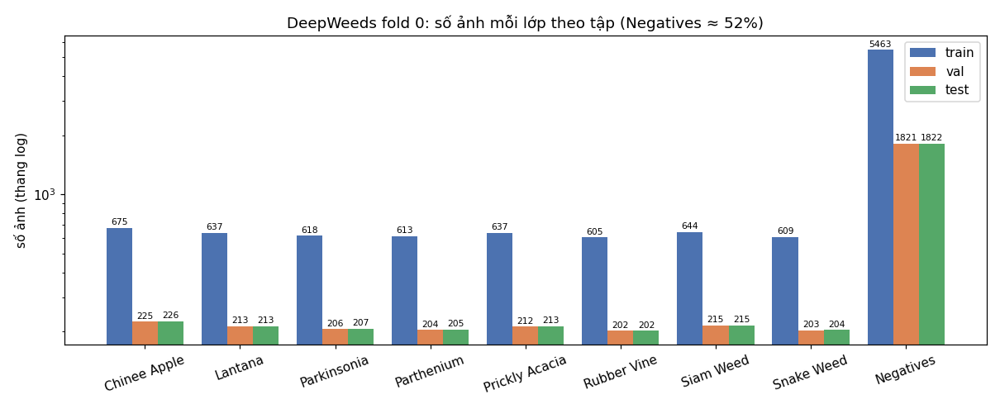
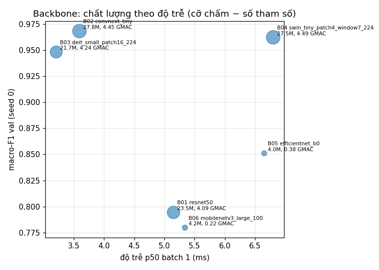
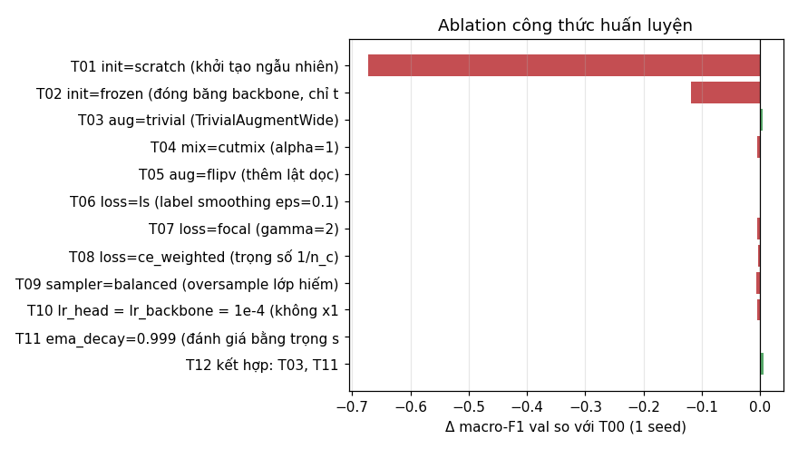
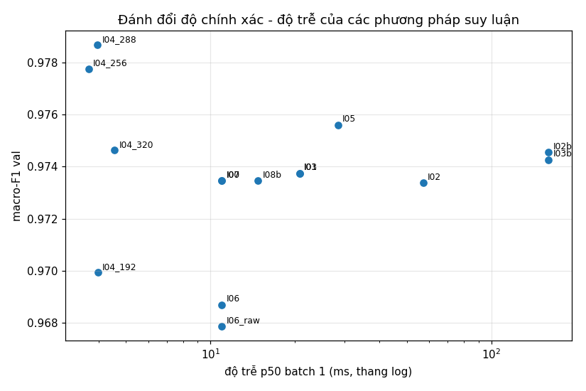
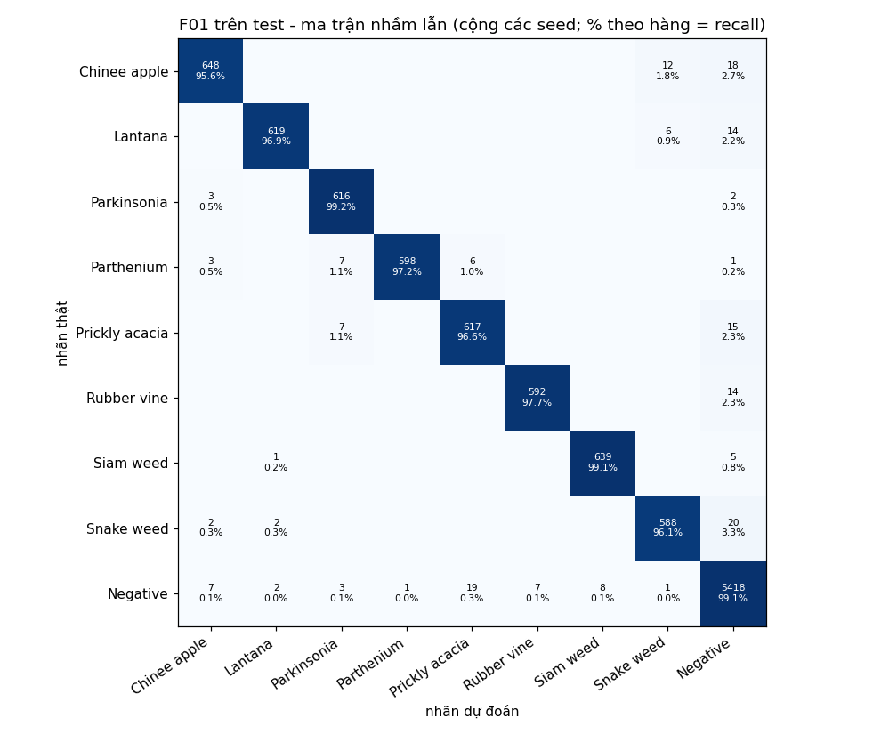
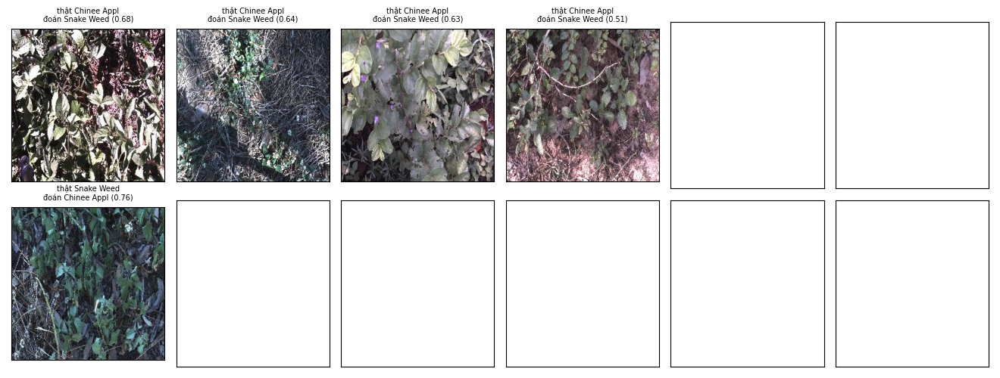

# Báo cáo Lab Day 2 – Backbone, công thức huấn luyện và suy luận trên DeepWeeds

**Sinh viên:** Nguyễn Công Thịnh – 2A202602781
**Nguồn số liệu:** mọi con số lấy từ `results.xlsx` (tự sinh bởi `code/make_results.py`), `results/eval/` (đầu ra của
`eval.py` gốc) và `runs/<exp_id>/seed<k>/history.csv`. Bảng đầy đủ dạng markdown: `results/tables.md`.

---

## 1. Tóm tắt

- **Bài toán:** phân loại 9 lớp DeepWeeds (8 loài cỏ dại + `Negative`), fold 0 chia sẵn, chỉ số chính macro-F1.
- **Đã làm:** 6 backbone (B01–B06), 11 ablation công thức huấn luyện một yếu tố (T01–T11) + 1 kết hợp (T12),
  13 cấu hình suy luận (I00–I08b), chung kết 3 seed cho cấu hình chọn (F01) và cho mốc (T00 + I00).
- **Cấu hình tốt nhất (chọn hoàn toàn trên val):** ConvNeXt-T (`convnext_tiny.in12k_ft_in1k`), công thức nền +
  TrivialAugmentWide + EMA 0.999, suy luận 1 view ở **288 px** (train 224 px) + temperature scaling khớp trên val.
- **Kết quả test (3 seed, chạy test một lần mỗi seed):** macro-F1 **0.9779 ± 0.0012**, top-1 **98.23 ± 0.10 %**,
  recall Chinee apple **95.6 ± 1.2 %**, Snake weed **96.1 ± 1.3 %**, ECE 0.0043 ± 0.0013.
  Mốc T00 + I00: macro-F1 0.9695 ± 0.0004 → **Δ = +0.0084**, lớn hơn std lớn hơn của hai nhóm (0.0012).
- **Kết luận chính:** dùng trọng số pretrained là điều kiện cần (từ đầu hoặc đóng băng mất 0.12–0.67 macro-F1); trong
  các lựa chọn còn lại, **backbone** tạo khác biệt lớn nhất (macro-F1 val 0.78–0.97 dưới cùng công thức). Giữa các cấu hình tốt, phần cải thiện ổn định qua 3 seed đến từ **suy luận ở độ phân giải 288 px**;
  phần cải thiện của **công thức huấn luyện** (T12) thấy ở seed 0 **không lặp lại** khi chạy 3 seed (xem mục 6.2).
- Độ trễ batch 1 của cấu hình chung kết trên RTX 4060: p95 = **15.0 ms**, nằm trong ngân sách 30–100 ms/khung.

## 2. Dữ liệu và thiết lập

### 2.1 Dữ liệu và kiểm tra chia tập

Dùng nguyên bản `train_subset0.csv`, `val_subset0.csv`, `test_subset0.csv` (không sửa, không lọc). Kiểm tra trong
`results/eda.json` (`split_check`) và `runs/<exp>/seed<k>/split_check.json`:

| Tập | Số ảnh | Tỉ lệ |
|---|---|---|
| train | 10 501 | 59.97 % |
| val | 3 501 | 20.00 % |
| test | 3 507 | 20.03 % |
| **hợp** | **17 509** | |

- Giao train∩val, train∩test, val∩test theo tên file: **0 / 0 / 0**; không trùng lặp trong từng tập; 0 file thiếu.
- Số ảnh từng lớp khớp Table 1 của bài báo, trừ hai lớp lệch 1 ảnh: Chinee apple 1 126 (bài báo 1 125) và Lantana
  1 063 (bài báo 1 064). Đây là số đếm từ CSV gốc của tác giả, không chỉnh sửa.

**Mất cân bằng:** `Negative` chiếm 9 106 / 17 509 ảnh (52 %); tỉ lệ lớp lớn nhất / lớp nhỏ nhất = 9.0. Vì vậy top-1
bị `Negative` kéo cao; mọi lựa chọn dùng macro-F1. Ảnh mẫu: `figures/eda_samples.png` (ảnh 256×256 RGB, chụp
ngoài đồng, nền phức tạp, ánh sáng loang lổ).

### 2.2 Kiểm tra pipeline trước khi chạy thật (`results/eda.json`, `pipeline_checks`)

| Kiểm tra | ResNet-50 | MobileNetV3 |
|---|---|---|
| Loss ban đầu (head khởi tạo 0) | 2.19722 (ln 9 = 2.19722) | 2.19722 |
| Loss ban đầu với head mặc định của timm | 2.2179 | 4.9205 |
| Overfit 1 batch 16 ảnh, 80 bước | loss 2.197 → 9.1e-5, acc 1.0 | loss 2.197 → 5.0e-7, acc 1.0 |
| `train()`/`eval()` đúng chế độ | đạt | đạt |

Ảnh sau augmentation (kiểm tra bằng mắt): `figures/eda_augmentations.png`, `figures/eda_cutmix_mixup.png`.

Ngoài ra `code/test_codes.py` có 24 test tự viết cho các phần dễ sai: focal γ=0 ≡ CE, CutMix λ đúng tỉ lệ diện
tích, không weight decay cho norm/bias, BN đóng băng ở chế độ eval, warmup + cosine, cập nhật EMA, gộp Conv-BN
chính xác, temperature scaling tìm lại T đã biết, file dự đoán được `eval.py` chấp nhận.

### 2.3 Công thức nền (dùng cho B01–B06 và T00)

| Thành phần | Giá trị |
|---|---|
| Khởi tạo | trọng số ImageNet của timm (tag ở bảng mục 3), head mới |
| Ảnh | 224 px; train: RandomResizedCrop + lật ngang; val/test: resize + center crop |
| Optimizer | AdamW, LR backbone 1e-4, LR head 1e-3 (×10), weight decay 0.05 (không áp cho norm/bias) |
| Lịch LR | warmup 1 epoch + cosine, 12 epoch, batch 64 |
| Loss | cross-entropy |
| Khác | AMP, channels_last, seed 0, fold 0 |
| Chọn checkpoint | epoch có macro-F1 val cao nhất (hoà lấy epoch sớm hơn) |

### 2.4 Phần cứng và phần mềm

RTX 4060 8 GB, CPU Intel i7-12700K, Windows 11 (driver WDDM). Python 3.10.18, PyTorch 2.13.0+cu130,
torchvision 0.28.0+cu130, timm 1.0.30, onnxruntime 1.23.2. Cấu hình đầy đủ + phiên bản thư viện của từng run nằm
trong `runs/<exp_id>/seed<k>/config.json`. Seed 0 cho Bước 1–3; seed 0, 1, 2 cho chung kết.

**Quy tắc val/test:** mọi lựa chọn (backbone, kết hợp, công thức chung kết, phương pháp suy luận, nhiệt độ T) dùng
**chỉ val**, theo luật viết sẵn trong code và ghi kèm lý do vào `results/decisions.json`. Test chạy **một lần cho mỗi
seed** ở cuối (`results/eval/TEST_DONE.json`, thời điểm 2026-10-05 21:47:41, `forced: false`; `final.py` từ chối
chạy lại test khi file này tồn tại).

## 3. So sánh backbone (Bước 1)

| exp_id | backbone | tag trọng số (timm) | params (M) | GMAC | macro-F1 val | top-1 val | best epoch | train/epoch (s, trung vị) | p50 batch 1 (ms) |
|---|---|---|---|---|---|---|---|---|---|
| B01 | ResNet-50 | resnet50.a1_in1k | 23.5 | 4.09 | 0.7944 | 0.8500 | 12 | 219 | 5.15 |
| **B02** | **ConvNeXt-T** | convnext_tiny.in12k_ft_in1k | 27.8 | 4.45 | **0.9681** | **0.9754** | 11 | 36 | 3.59 |
| B03 | DeiT-S | deit_small_patch16_224.fb_in1k | 21.7 | 4.24 | 0.9480 | 0.9612 | 12 | 25 | 3.21 |
| B04 | Swin-T | swin_tiny_patch4_window7_224.ms_in1k | 27.5 | 4.49 | 0.9621 | 0.9712 | 7 | 43 | 6.80 |
| B05 | EfficientNet-B0 | efficientnet_b0.ra_in1k | 4.0 | 0.38 | 0.8510 | 0.8880 | 11 | 125 | 6.65 |
| B06 | MobileNetV3-L | mobilenetv3_large_100.ra_in1k | 4.2 | 0.22 | 0.7798 | 0.8343 | 12 | 71 | 5.34 |

Đủ ràng buộc: ResNet (B01), ConvNeXt (B02), 2 transformer (B03, B04), 2 mạng nhẹ (B05, B06). Cùng công thức nền, cùng
split, cùng seed 0; `config.json` của các run chỉ khác nhau ở tên backbone.

*Ghi chú thời gian train:* bảng dùng **trung vị** thời gian mỗi epoch từ `history.csv`. Sheet `Backbones` trong xlsx
ghi **trung bình**, nên B05 ở đó là 355.6 s: epoch 8 của B05 mất 2 876 s do GPU bị tranh chấp bộ nhớ với ứng dụng
khác trên máy (các epoch còn lại ≈ 119–137 s).

**Nhận xét.**

- ConvNeXt-T và hai transformer đạt 0.95–0.97; ba CNN dùng BatchNorm (ResNet-50, EfficientNet-B0, MobileNetV3) chỉ
  0.78–0.85. Đường cong cho thấy đây là **học chưa xong (underfit)**, không phải quá khớp: B01 có train loss cuối
  0.378 (B02: 0.037), macro-F1 val ở epoch 1 chỉ 0.229 và vẫn tăng tới epoch 12. Giả thuyết: công thức chung
  (AdamW, LR backbone 1e-4, 12 epoch) hợp với ConvNeXt/ViT nhưng quá chậm cho các trọng số `a1`/`ra` của timm; vì
  vậy kết quả này là **"kém dưới công thức này"**, không phải kết luận về kiến trúc.
- Ba CNN BatchNorm cũng chậm hơn rõ rệt mỗi epoch (71–219 s so với 36 s của ConvNeXt-T dù GMAC thấp hơn hoặc tương
  đương). Tôi chưa tìm được nguyên nhân chắc chắn (nghi đường cuDNN cho BN + channels_last + AMP trên bản PyTorch này);
  không dùng thời gian train làm căn cứ chọn.
- B04 (Swin-T) quá khớp nhẹ: val loss thấp nhất 0.097 ở epoch 7 rồi tăng lên 0.111 ở epoch 12, macro-F1 giảm từ
  0.9621 xuống 0.9578 (`curves/B04_swin_tiny.png`).

**Chọn backbone đi tiếp (luật trong `run_all.py`, chỉ val):** lấy các backbone có macro-F1 val cách tốt nhất < 0.01
(chỉ 1 seed nên chênh nhỏ coi như ngang nhau) → nhóm {B02, B04}; trong nhóm chọn cái có p50 batch 1 thấp nhất →
**B02 ConvNeXt-T** (0.9681, 3.59 ms) thay vì Swin-T (0.9621, 6.80 ms).

## 4. Công thức huấn luyện (Bước 2)

Mỗi run T01–T11 khác T00 (= B02, ConvNeXt-T, seed 0) **đúng một yếu tố**. 6 trục: A khởi tạo, B augmentation,
C loss, D sampler, E LR/optimizer, F chính quy hoá (EMA).

**Mức nhiễu:** T00 chạy 3 seed cho macro-F1 val 0.9681 / 0.9721 / 0.9708 → **0.9703 ± 0.0020** (std mẫu). Lưu ý seed 0
(dùng làm mốc cho mọi ablation) là seed **thấp nhất** trong ba seed, nên Δ so với T00 seed 0 có xu hướng lạc quan
khoảng +0.002.

| exp_id | trục | khác T00 ở | macro-F1 val | Δ vs T00 seed 0 | Δ / std (0.0020) | F1 Chinee val | F1 Snake val | kết luận |
|---|---|---|---|---|---|---|---|---|
| T00 | – | công thức nền | 0.9681 | 0 | – | 0.9447 | 0.9268 | mốc |
| T01 | A | init = scratch | 0.2962 | −0.6719 | ≫ | 0.2267 | 0.2682 | kém hẳn |
| T02 | A | init = frozen (chỉ train head) | 0.8495 | −0.1186 | ≫ | 0.8287 | 0.7752 | kém hẳn |
| T03 | B | aug = TrivialAugmentWide | 0.9729 | +0.0048 | 2.4 | 0.9543 | 0.9343 | có thể giúp (1 seed) |
| T04 | B | CutMix α=1 | 0.9632 | −0.0049 | −2.4 | 0.9433 | 0.9234 | có thể hại (1 seed) |
| T05 | B | thêm lật dọc | 0.9698 | +0.0017 | 0.8 | 0.9488 | 0.9383 | không phân biệt được |
| T06 | C | label smoothing 0.1 | 0.9677 | −0.0004 | −0.2 | 0.9358 | 0.9242 | không phân biệt được |
| T07 | C | focal γ=2 | 0.9629 | −0.0052 | −2.6 | 0.9436 | 0.9242 | có thể hại (1 seed) |
| T08 | C | CE trọng số 1/n_c | 0.9653 | −0.0028 | −1.4 | 0.9440 | 0.9242 | không phân biệt được |
| T09 | D | sampler cân bằng | 0.9613 | −0.0068 | −3.4 | 0.9488 | 0.9135 | hại |
| T10 | E | LR head = LR backbone (bỏ ×10) | 0.9627 | −0.0054 | −2.7 | 0.9324 | 0.9200 | có thể hại (1 seed) |
| T11 | F | EMA 0.999 | 0.9687 | +0.0006 | 0.3 | 0.9447 | 0.9291 | không phân biệt được |
| T12 | kết hợp | T03 + T11 | 0.9735 | +0.0053 | 2.7 | 0.9543 | 0.9366 | xem 6.2 |

**Nhận xét theo trục (đọc kèm đường cong trong `curves/`).**

- **Khởi tạo (A):** pretrained là yếu tố lớn nhất của trục huấn luyện. Từ đầu (T01) sau 12 epoch chỉ đạt 0.296,
  train loss vẫn 1.205, nên 12 epoch là quá ít để học từ đầu với ~10 k ảnh. Đóng băng backbone (T02) bị giới hạn
  năng lực: train loss 0.363 ≈ val loss 0.368, tức là underfit chứ không phải quá khớp. Nhanh hơn ~2.7 lần mỗi epoch
  (13.9 s so với 37 s) nhưng mất 0.12 macro-F1.
- **Augmentation (B):** TrivialAugmentWide là thay đổi duy nhất có Δ dương > 2 std, phù hợp với ảnh ngoài đồng
  có độ sáng/màu biến thiên mạnh. CutMix hại ở 12 epoch: train loss cuối 0.482 (nhãn trộn) cho thấy mô hình chưa
  khai thác hết được chính quy hoá mạnh trong ngân sách epoch này. Lật dọc không đổi gì (ảnh chụp từ trên xuống nên
  lật dọc vốn đã "hợp lệ", nhưng không thêm thông tin).
- **Loss (C) và sampler (D):** cả ba cách bù mất cân bằng (focal, CE trọng số, sampler cân bằng) **không giúp**
  macro-F1; sampler cân bằng hại rõ nhất (−3.4 std), Snake weed F1 giảm còn 0.9135. Giả thuyết: mất cân bằng chỉ
  9:1 và mỗi lớp cỏ vẫn có ~600 ảnh train, nên bù lại chủ yếu làm lặp ảnh lớp hiếm (dễ quá khớp) và đổi
  precision/recall của `Negative`. Label smoothing không đổi F1; val loss của nó cao hơn (0.17) do mục tiêu mềm,
  không so trực tiếp được với các run khác.
- **LR (E):** bỏ hệ số ×10 cho head làm giảm 0.0054, ủng hộ việc dùng LR head lớn hơn (slide trang 52).
- **EMA (F):** trên cùng epoch, trọng số EMA so với trọng số thường: 0.9687 vs 0.9679 (I06 vs I06_raw), chênh nhỏ
  hơn nhiễu.

**Kết hợp (T12) – thiết kế tham lam theo trục:** luật trong `run_all.py` lấy mỗi trục giá trị có Δ lớn nhất nếu
Δ ≥ 0.003; chỉ có trục B đạt (T03), nên luật dự phòng lấy 2 trục có Δ dương lớn nhất: T03 (+0.0048) và T11 (+0.0006).
T12 đạt 0.9735, tức +0.0006 so với T03 riêng lẻ, **cộng dồn không đáng kể** (EMA đóng góp ít như T11 cho thấy). Chọn công thức chung
kết (chỉ val, seed 0): T00 0.9681 / T03 0.9729 / T12 0.9735 → T12.

Toàn bộ ablation chỉ có **1 seed**; các kết luận "có thể giúp/hại" ở trên chỉ là xu hướng, ngoại trừ T01/T02 có
chênh lệch rất lớn so với nhiễu.

## 5. Suy luận (Bước 3)

Mọi phương pháp dùng mô hình T12 seed 0 và đánh giá trên **val**. Độ trễ đo bằng `code/benchmark.py`: warmup 10 lần,
`torch.cuda.synchronize()` trước và sau mỗi lần đo, 100 lần (batch 1) / 50 lần (batch 32), báo cáo p50/p95/p99;
RTX 4060, FP32 trừ khi ghi AMP. K = số lượt forward.

| exp_id | phương pháp | K | macro-F1 val | top-1 val | ECE val | p50 b1 (ms) | p95 b1 (ms) | p99 b1 (ms) | ảnh/s b32 |
|---|---|---|---|---|---|---|---|---|---|
| I00 | 1 view 224 (mốc) | 1 | 0.9735 | 0.9797 | 0.0079 | 10.97 | 15.79 | 17.96 | 521 |
| I01 | TTA lật ngang, gộp xác suất | 2 | 0.9737 | 0.9800 | 0.0081 | 20.78 | 29.31 | 32.19 | 260 |
| I03 | TTA lật ngang, gộp logit | 2 | 0.9737 | 0.9800 | 0.0084 | 20.78 | 29.31 | 32.19 | 260 |
| I02 | TTA 5 crop, gộp xác suất | 5 | 0.9734 | 0.9794 | 0.0057 | 57.24 | 64.42 | 74.23 | 104 |
| I02b | TTA 10 crop, gộp xác suất | 10 | 0.9746 | 0.9806 | 0.0050 | 159.90 | 217.60 | 223.33 | 53 |
| I03b | TTA 10 crop, gộp logit | 10 | 0.9743 | 0.9803 | 0.0081 | 159.90 | 217.60 | 223.33 | 53 |
| I04_192 | độ phân giải kiểm tra 192 | 1 | 0.9699 | 0.9774 | 0.0110 | 3.97 | 4.50 | 4.56 | 726 |
| I04_256 | độ phân giải kiểm tra 256 | 1 | 0.9778 | 0.9829 | 0.0064 | 3.68 | 4.47 | 5.38 | 404 |
| **I04_288** | **độ phân giải kiểm tra 288** | 1 | **0.9787** | **0.9831** | 0.0073 | 3.96 | 4.87 | 6.05 | 304 |
| I04_320 | độ phân giải kiểm tra 320 | 1 | 0.9746 | 0.9803 | 0.0049 | 4.55 | 6.69 | 7.30 | 226 |
| I05 | ensemble T12 + B04 + B03 (TB xác suất) | 3 | 0.9756 | 0.9823 | 0.0175 | 28.46 | 39.67 | 45.37 | 64 |
| I06_raw / I06 | T11: trọng số thường / EMA | 1 | 0.9679 / 0.9687 | 0.9754 / 0.9760 | 0.0106 / 0.0104 | – | – | – | – |
| I07 | temperature scaling (T = 1.299, khớp trên val) | 1 | 0.9735 | 0.9797 | **0.0050** | 10.97 | 15.79 | 17.96 | 521 |
| I08 | gộp BN | – | – | – | – | – | – | – | – |
| I08b | AMP (autocast FP16) | 1 | 0.9735 | 0.9797 | 0.0081 | 14.76 | 19.10 | 21.14 | 931 |

I08 không áp dụng được vì ConvNeXt-T dùng LayerNorm, không có BatchNorm (phần gộp Conv-BN vẫn được cài đặt và kiểm
tra đúng trên ResNet/MobileNet trong `test_codes.py`). Ensemble I05 dùng logit val đã lưu của B04 và B03; độ trễ của
ensemble là tổng độ trễ các mô hình chạy tuần tự.

**Hiệu chuẩn.** ECE val trước/sau temperature scaling: 0.0079 → 0.0050 (đánh giá chéo 2-fold trên val để không
dùng cùng dữ liệu để khớp và để đo; khớp và đo trên toàn bộ val: 0.0045). Biểu đồ độ tin cậy: `figures/reliability_val.png`.
TS không đổi argmax nên macro-F1/top-1 giữ nguyên.

**Nhận xét.**

- **Độ phân giải kiểm tra** là phương pháp tốt nhất và rẻ nhất: 256–288 px tăng +0.004–0.005 macro-F1 val so với
  224 px với chỉ 1 forward, đúng hiệu ứng FixRes (RandomResizedCrop lúc train làm vật thể trông to hơn so với
  center crop lúc test, tăng độ phân giải test bù lại chênh lệch đó). 320 px bắt đầu giảm, 192 px giảm.
- **TTA** (lật, 5/10 crop) chỉ thêm 0–0.001, nhỏ hơn nhiễu, với chi phí 2–15 lần. Gộp xác suất và gộp logit cho
  macro-F1 gần như nhau; gộp xác suất cho ECE tốt hơn ở 10 crop (0.0050 so với 0.0081).
- **Ensemble** 3 backbone khác họ tăng +0.002 nhưng ECE xấu đi rõ (0.0175) và chậm hơn ~2.6 lần.
- **AMP** không đổi độ chính xác; ở batch 1 không nhanh hơn (chi phí autocast lấn át ở mô hình nhỏ), nhưng tăng
  thông lượng batch 32 từ 521 lên 931 ảnh/s.
- **Độ tin cậy của số độ trễ batch 1:** máy là desktop Windows, GPU đồng thời chạy màn hình và ứng dụng khác, nên độ trễ
  batch 1 dao động mạnh giữa các lần đo. Cùng một ConvNeXt-T 224 px đo được p50 3.59 ms ở Bước 1 nhưng 10.97 ms ở
  Bước 3, và 288 px (3.96 ms) đo nhanh hơn 224 px trong cùng bảng. Vì vậy so sánh chi phí giữa các phương pháp nên
  dựa vào **thông lượng batch 32** (ổn định hơn: 224 px 521 ảnh/s > 288 px 304 ảnh/s > 320 px 226 ảnh/s, đúng thứ
  tự kỳ vọng) và hệ số K.
- **Ngoại tuyến vs thời gian thực:** với robot (ngân sách 30–100 ms/khung), dùng 1 view ở 256–288 px + TS; mọi
  phương pháp K ≤ 5 đều nằm trong ngân sách trên GPU này, riêng TTA 10 crop (p95 218 ms) vượt ngân sách và chỉ hợp
  xử lý ngoại tuyến, nhưng nó cũng không chính xác hơn 288 px.

**Chọn phương pháp cho F01 (luật trong `infer_experiments.py`, chỉ val):** trong các phương pháp áp dụng được cho
một mô hình, lấy macro-F1 val cao nhất, chỉ đổi khỏi I00 nếu hơn ≥ 0.002 → **I04_288**; sau đó luôn áp dụng
temperature scaling khớp trên val (mỗi seed một T riêng: 1.179 / 1.070 / 1.103, `results/final_temperatures.json`).

## 6. Cấu hình tốt nhất và kết quả chung kết (Bước 4)

### 6.1 Cấu hình F01 (đủ để tái lập)

ConvNeXt-T `convnext_tiny.in12k_ft_in1k`; công thức nền mục 2.3 + `aug=trivial` (RandomResizedCrop + lật ngang +
TrivialAugmentWide) + EMA decay 0.999 (đánh giá và lưu checkpoint bằng trọng số EMA); 12 epoch; checkpoint = epoch
macro-F1 val cao nhất. Suy luận: resize 329 + center crop 288 px, 1 view, softmax(logit / T) với T khớp trên val.
Seed 0, 1, 2. Mốc: T00 (công thức nền) + I00 (1 view 224 px, không TS), cùng 3 seed.

### 6.2 Kết quả test (3 seed, std mẫu ddof=1; tính lại bằng `eval.py score`)

| Cấu hình | macro-F1 val | macro-F1 test | top-1 test | balanced acc test | ECE test | recall Chinee apple | recall Snake weed |
|---|---|---|---|---|---|---|---|
| **F01** | 0.9762 ± 0.0024 | **0.9779 ± 0.0012** | **0.9823 ± 0.0010** | 0.9749 ± 0.0021 | 0.0043 ± 0.0013 | 0.9558 ± 0.0117 | 0.9608 ± 0.0130 |
| F01 trước TS | – | 0.9779 ± 0.0012 | 0.9823 ± 0.0010 | 0.9749 ± 0.0021 | 0.0059 ± 0.0020 | 0.9558 ± 0.0117 | 0.9608 ± 0.0130 |
| Mốc T00 + I00 | 0.9703 ± 0.0020 | 0.9695 ± 0.0004 | 0.9757 ± 0.0004 | 0.9709 ± 0.0031 | 0.0106 ± 0.0001 | 0.9381 ± 0.0160 | 0.9493 ± 0.0075 |

Theo seed (macro-F1 test): F01 0.9766 / 0.9783 / 0.9789; T00 0.9690 / 0.9696 / 0.9699 (`results/eval/*_per_seed.csv`).

- **Δ macro-F1 test = +0.0084**, std lớn hơn s = 0.0012 → vượt nhiễu (Δ ≈ 7 s), nhưng < 0.01.
- **Hiệu chuẩn trên test:** ECE 0.0059 → 0.0043 sau TS (NLL 0.0561 → 0.0557).
- **Val ↔ test:** macro-F1 val 0.9762 so với test 0.9779, chênh 0.0018 (< 0.02), không có dấu hiệu chọn quá khớp val.
- So với bài báo (*trích dẫn*, ResNet-50, 5 fold, ~100 epoch): 95.7 % accuracy, recall Chinee apple 88.5 %, Snake
  weed 88.8 %. Số của bài lab cao hơn, nhưng khác định nghĩa (weighted vs top-1), khác số fold và khác backbone, nên
  chỉ để tham khảo.
- `eval.py grade` (đề xuất, ngưỡng tạm thời): I1 7/7, I2 4/5, I3 4/4, I4a 1/1, I4b 1/1, I5 2/2 → 19/20
  (`results/eval/grade.md`).

**Tách đóng góp của huấn luyện và suy luận.** Δ test ở trên gộp cả công thức T12 lẫn suy luận 288 px + TS. Lịch sử
huấn luyện cho phép tách trên val (cùng 3 seed, 1 view 224 px, trọng số EMA):

| | seed 0 | seed 1 | seed 2 | mean |
|---|---|---|---|---|
| T00, macro-F1 val 224 px | 0.9681 | 0.9721 | 0.9708 | 0.9703 |
| F01 (công thức T12), macro-F1 val 224 px | 0.9735 | 0.9689 | 0.9691 | 0.9705 |
| F01, macro-F1 val 288 px + TS | 0.9787 | 0.9759 | 0.9740 | 0.9762 |

Công thức T12 hơn T00 rõ ở seed 0 (+0.0054) nhưng **thua ở seed 1 và 2**; trung bình 3 seed gần như bằng nhau
(+0.0002). Phần tăng ổn định ở cả 3 seed đến từ suy luận 288 px (+0.0057 trung bình trên val). Vì vậy Δ test +0.0084
nhiều khả năng chủ yếu do độ phân giải kiểm tra. Kiểm chứng trực tiếp cần chấm mốc T00 ở 288 px, việc này chưa làm
(và không làm trên test vì test chỉ chạy một lần mỗi seed).

### 6.3 Phân tích lỗi

Ma trận nhầm lẫn cộng 3 seed (`results/eval/F01_confusion_sum.csv`, 3 × 3 507 ảnh), các ô lỗi lớn nhất:

| Nhãn thật → dự đoán | số ảnh (3 seed) | tỉ lệ trong lớp thật |
|---|---|---|
| Snake weed → Negative | 20 | 3.3 % |
| Negative → Prickly acacia | 19 | 0.3 % |
| Chinee apple → Negative | 18 | 2.7 % |
| Prickly acacia → Negative | 15 | 2.3 % |
| Lantana → Negative | 14 | 2.2 % |
| Rubber vine → Negative | 14 | 2.3 % |
| Chinee apple → Snake weed | 12 | 1.8 % |
| Parthenium → Parkinsonia / Prickly acacia → Parkinsonia | 7 / 7 | 1.1 % / 1.1 % |
| Snake weed → Chinee apple | 2 | 0.3 % |

F1 từng lớp (test, 3 seed): thấp nhất là Prickly acacia 0.963, Snake weed 0.965, Chinee apple 0.966; cao nhất Siam weed
0.989 và Negative 0.988. So với mốc, F01 cải thiện F1 Chinee apple 0.949 → 0.966, Snake weed 0.950 → 0.965 và
precision Prickly acacia 0.923 → 0.961 (bảng `PerClass` trong xlsx).

**Giả thuyết.**

1. **Nhầm lẫn chủ yếu là cỏ ↔ `Negative`, không phải giữa hai loài cỏ.** 89 / 138 lỗi ở hàng các loài cỏ là đoán thành
   `Negative`. Lớp `Negative` chứa thực vật đủ loại ở cùng địa điểm nên rất đa dạng; khi cây mục tiêu nhỏ, bị che
   hoặc lẫn trong nền thì "không có loài mục tiêu" là câu trả lời hợp lý với mô hình.
2. **Chinee apple → Snake weed (12) nhiều hơn chiều ngược lại (2)** (bài báo: 3.4 % và 4.1 %). Ở seed 0 có 4 ảnh
   Chinee apple bị đoán thành Snake weed với độ tin cậy chỉ 0.51–0.68: ảnh có nắng gắt loang lổ (lá bị cháy sáng,
   mất màu và vân), nhiều cỏ khô/đất làm nền và cây mục tiêu chiếm phần nhỏ khung hình. Cả hai loài đều có lá xanh
   cỡ vừa mọc sát đất, nên khi mất chi tiết màu/vân lá thì khó phân biệt. Độ tin cậy thấp cho thấy có thể dùng ngưỡng
   độ tin cậy (sau TS) để chuyển các ảnh này sang người kiểm tra.
3. **Prickly acacia ↔ Parkinsonia / Parthenium:** đều là cây có lá kép nhỏ, khi chụp từ trên xuống thì hình thái gần
   giống nhau (bài báo cũng ghi nhầm Parkinsonia → Prickly acacia 1.3 %).

## 7. Kết luận và khuyến nghị

- **Cấu hình tốt nhất:** F01 = ConvNeXt-T + TrivialAugment + EMA, suy luận 288 px + temperature scaling; macro-F1 test
  0.9779 ± 0.0012, top-1 98.23 ± 0.10 %, hơn mốc 0.9695 ± 0.0004 một khoảng **+0.0084, vượt nhiễu** (3 seed).
- **Yếu tố đóng góp nhiều nhất:**
  0. **Khởi tạo pretrained** là điều kiện cần: từ đầu (T01) hoặc đóng băng backbone (T02) mất 0.67 và 0.12 macro-F1 val.
  1. **Backbone** (dưới cùng công thức, đều pretrained): macro-F1 val từ 0.78 (MobileNetV3) đến 0.97 (ConvNeXt-T), gấp
     hàng chục lần các yếu tố huấn luyện/suy luận nhỏ; ngay cả giữa hai backbone tốt nhất cũng chênh 0.006 (B02 vs B04).
     Kèm lưu ý: các CNN BatchNorm có thể bị công thức chung bất lợi (mục 3).
  2. **Suy luận** (độ phân giải kiểm tra 288 px): +0.005–0.006 macro-F1 val, lặp lại ở cả 3 seed, không tốn thêm forward.
  3. **Các thay đổi nhỏ trong công thức huấn luyện** (augmentation, loss, sampler, LR, EMA): chưa có yếu tố nào được chứng minh vượt nhiễu qua nhiều seed; TrivialAugment có xu hướng tốt ở seed 0
     nhưng không lặp lại ở seed 1–2.
- **Triển khai trên robot (ngân sách 30–100 ms/khung):** chọn F01 (1 view, 288 px, TS). Trên RTX 4060: p50 11.1 ms,
  **p95 15.0 ms**, p99 21.6 ms ở batch 1 (đo trong `final.py`, warmup + synchronize). Nếu thiết bị chỉ có CPU,
  ConvNeXt-T 224 px trên i7-12700K có p95 98.7 ms, sát ngân sách 100 ms. Trên Jetson cần đo lại và dùng TensorRT/FP16.
  Dùng xác suất đã hiệu chuẩn để đặt ngưỡng "không chắc → không phun / hỏi người".

## 8. Hạn chế và việc tiếp theo

- **Một fold, chia ngẫu nhiên (không theo địa điểm):** ảnh cùng địa điểm/cùng đợt chụp có thể nằm ở cả train và test,
  nên điểm test có thể **lạc quan** so với khi gặp địa điểm, mùa hoặc camera mới (rủi ro lệch phân phối).
- **Số seed:** ablation Bước 1–3 chỉ 1 seed; chung kết 3 seed. Mốc T00 seed 0 lại là seed thấp nhất, làm Δ của các
  ablation lạc quan khoảng 0.002. Kết luận về từng yếu tố nhỏ cần thêm seed.
- **Phương pháp suy luận được chọn trong ~10 ứng viên trên val** (thiên lệch "người thắng"). Test xác nhận phần lớn
  (chênh val/test 0.0018), nhưng chưa có thí nghiệm T00 ở 288 px để tách riêng hiệu ứng của độ phân giải.
- **Ngân sách GPU:** 12 epoch thay vì ~100 như bài báo; scratch, CutMix và các CNN BatchNorm có thể cần nhiều epoch
  hơn để công bằng. Nhiều run có epoch tốt nhất là 11–12, tức là vẫn đang cải thiện.
- **Đo độ trễ trên desktop Windows** dùng chung GPU với màn hình: độ trễ batch 1 dao động (cùng mô hình 3.6–11 ms);
  chưa đo trên phần cứng nhúng.
- **ONNX (bonus):** ONNX Runtime CPU (p50 396 ms) chậm hơn PyTorch CPU (p50 93.6 ms) với cùng mô hình 224 px. Tôi chưa
  tinh chỉnh ORT (số luồng, mức tối ưu đồ thị), nên đây là cấu hình mặc định, chưa phải giới hạn của ONNX.
- **Thí nghiệm thất bại:** CutMix, focal, CE trọng số, sampler cân bằng không giúp; ba CNN BatchNorm kém dưới
  công thức chung.
- **Việc tiếp theo:** chạy T00 ở 288 px và thêm seed cho T03/T12 để tách đóng góp; thử LR riêng cho CNN BatchNorm;
  nhiều fold; Grad-CAM cho các ảnh Chinee apple ↔ Snake weed; đánh giá trên ảnh bị nhiễu/thiếu sáng.

## 9. Phụ lục

- **Danh sách thí nghiệm và cấu hình đầy đủ:** sheet `Backbones`, `Training`, `Inference`, `Final`, `PerClass`,
  `Latency`, `Summary` trong `results.xlsx`; `runs/<exp_id>/seed<k>/config.json` (không commit, kích thước lớn).
- **Lý do mọi lựa chọn:** `results/decisions.json`.
- **Đường cong huấn luyện:** `curves/<exp_id>_<mô tả>.png`, mỗi run B01–B06, T00–T12, F01 seed 0–2, T00 seed 1–2 một ảnh.
- **File dự đoán:** `predictions/F01_seed{0,1,2}_{test,val}.csv`, `predictions/F01_uncal_seed{0,1,2}_test.csv`,
  `predictions/T00_seed{0,1,2}_{test,val}.csv`.
- **Đầu ra của `eval.py`:** `results/eval/` (`score_*.md`, `grade.md`, `*_per_class.csv`, `*_confusion_sum.csv`).
- **Code và notebook:** `code/` (xem `README.md` để biết thứ tự chạy); notebook `code/lab_day2.ipynb`.
